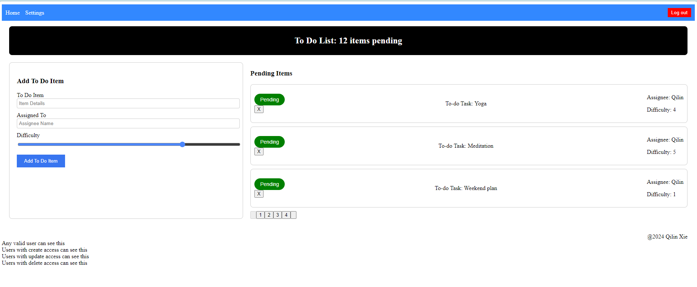
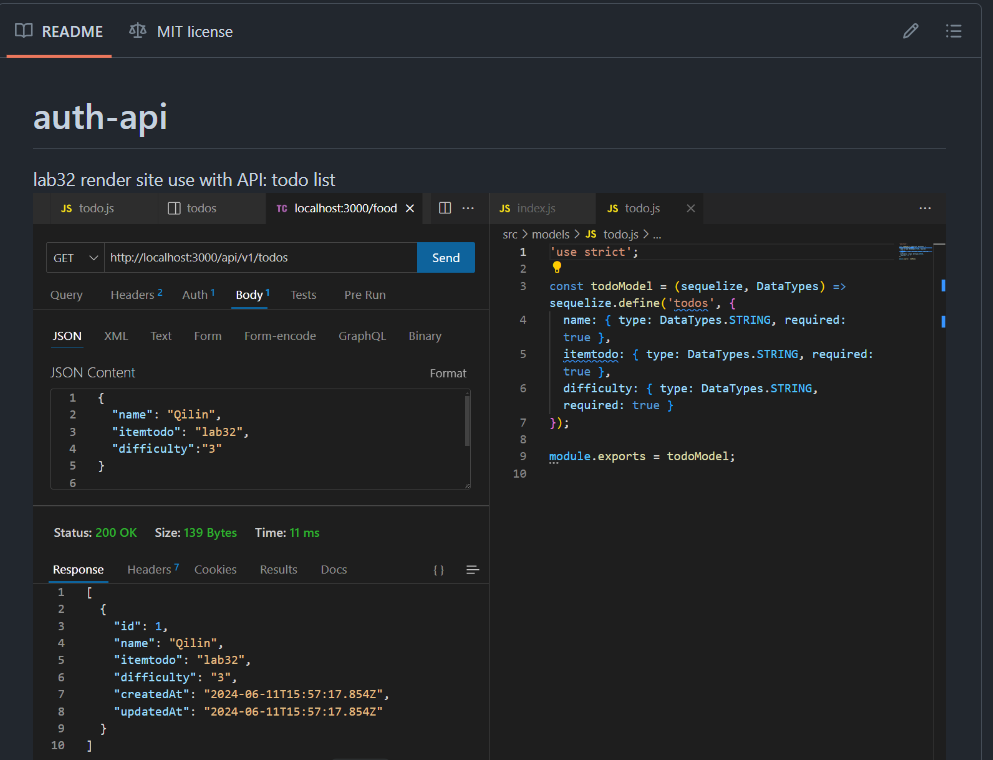
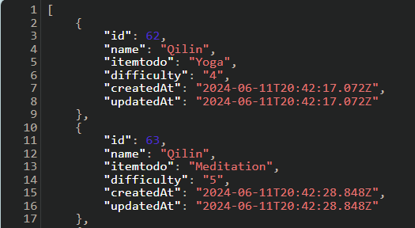
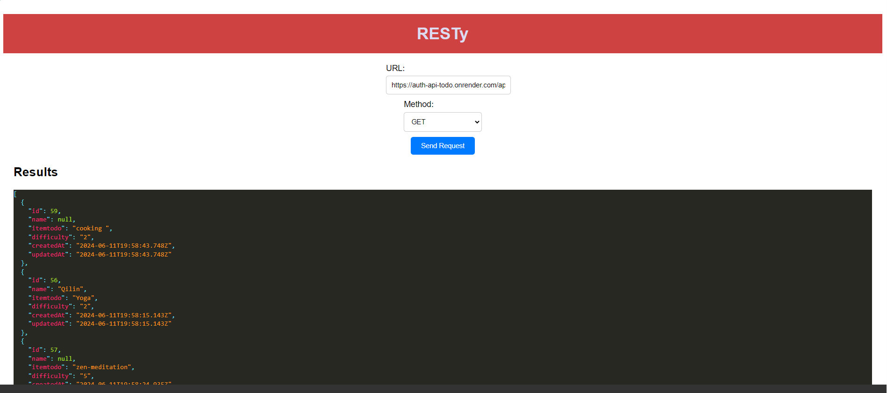
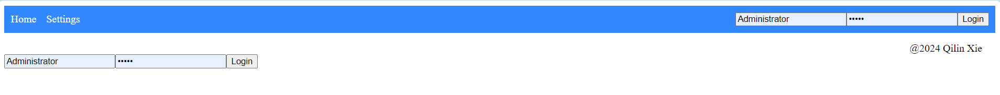
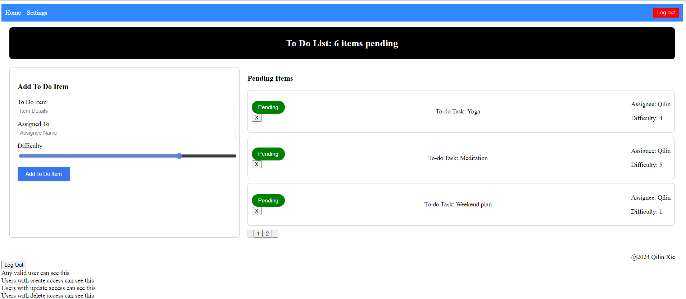
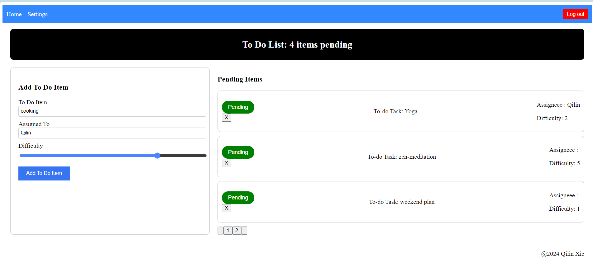
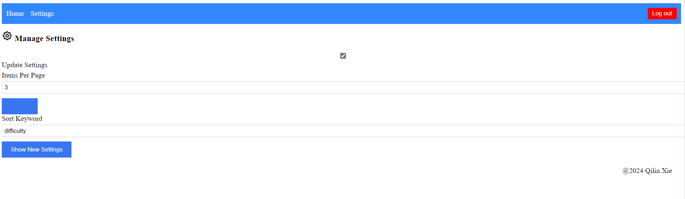
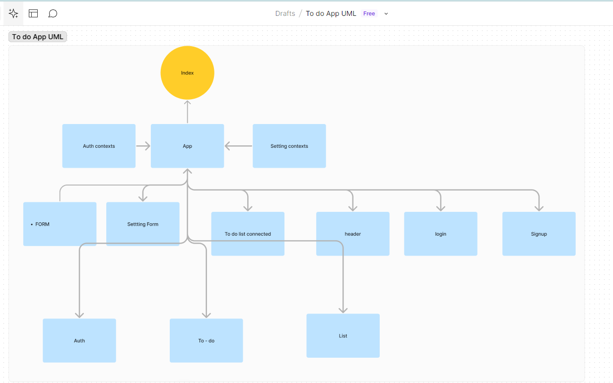

# Todo-App

## Day 4
To Do List Manager Phase 4: Integrating with a live API.

In this final phase, users will be logged in through a live authentication server to see the to-do items. Additionally, based on their user type, they will be allowed (or denied) to perform actions such as editing or deleting them. All To Do items will be stored in a database, accessed through a deployed API.

- **Username**: 

 @ [GitHub](https://github.com/QILINXIE02/auth-api)

- Also, try getting it with my RESTy app @ [RESTy](https://qilin-resty.netlify.app/):

## Day 3
In Phase 3, I extended the functionality of the application by requiring users to be logged in to view items and restricting access based on user type. The user stories from Phases 1 and 2 remain unchanged.

- **Login with admin**:

## Day 2
To Do List Manager Phase 2: Incorporate configuration settings into the application.

## Phase 1 Requirements
This application currently combines application state and user settings at the top level, which was a good proof of concept. However, to make it production-ready, we need to properly modularize the application into separate components and implement the Context API to manage basic application settings.

In Phase 1, global state is managed through the Context API, specifically in the `Settings` context. This context provides settings such as the number of items to display per screen, whether to hide completed items, and the default sorting field. Components consume these settings by accessing the `SettingsContext`, either directly or through custom hooks, and utilizing the settings values provided by the context.

### Day 1
- **UML**:

### Global State Consumption

### Operation of the `useForm()` Hook
The `useForm()` hook is a custom hook designed to manage form state and submission. It takes two parameters: a callback function to be executed upon form submission, and an optional object containing default form values.

- **handleSubmit**: This function is called when the form is submitted. It prevents the default form submission behavior, then executes the provided callback function, passing the current form values as an object.

- **handleChange**: This function is responsible for updating form values as the user types or interacts with form elements. It takes an event object as input and extracts the name and value of the input field from it. It then updates the form state with the new value.

The hook utilizes React's `useState` hook internally to manage form state, ensuring that the form values are reactive and update the UI accordingly.

## Credit
ChatGPT helped implement the test files.
